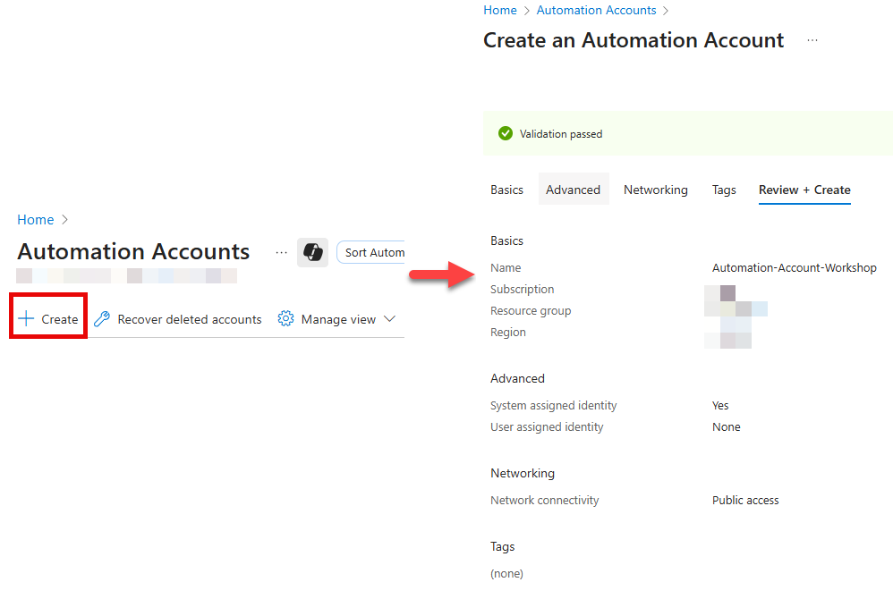
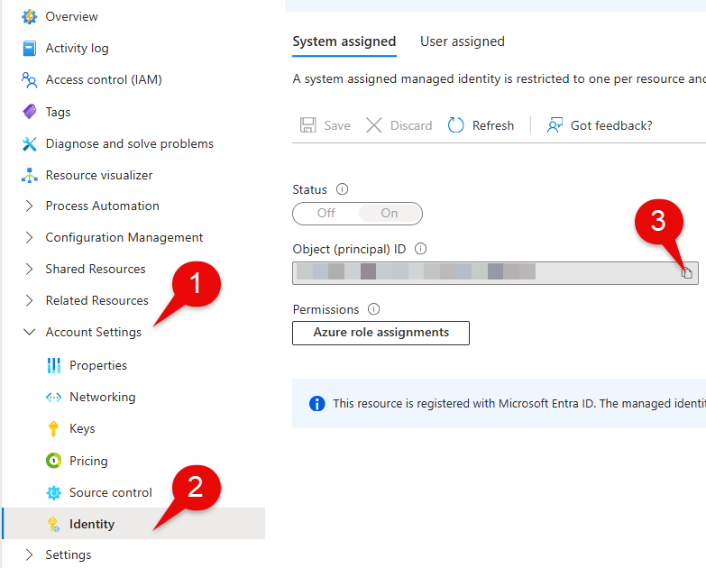
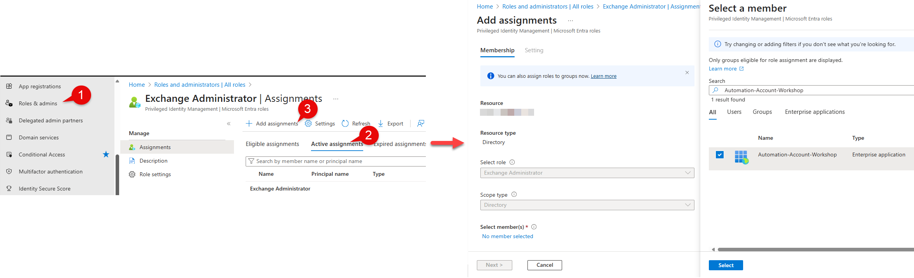
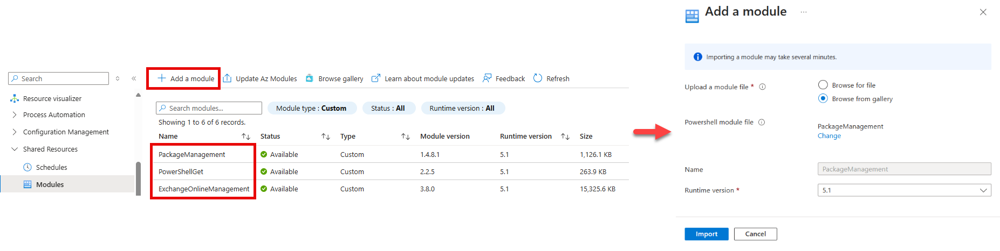
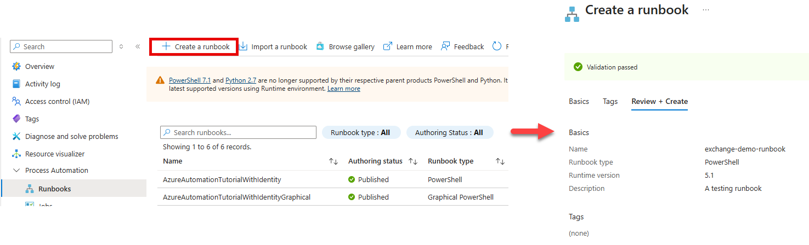
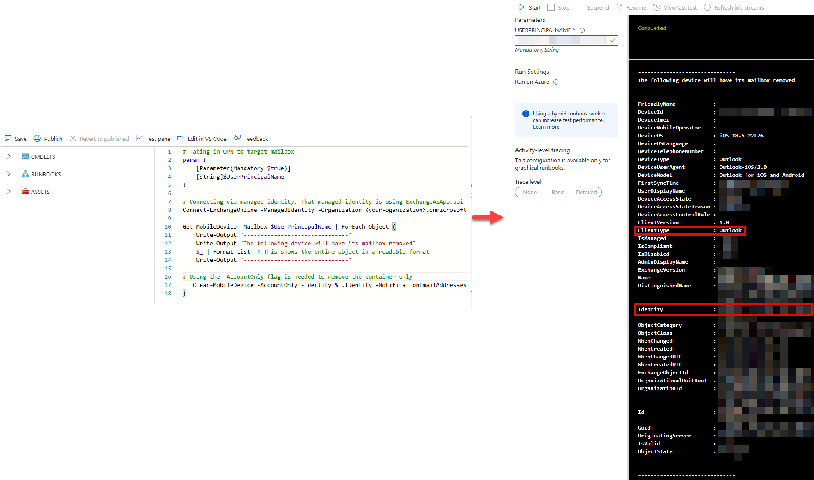
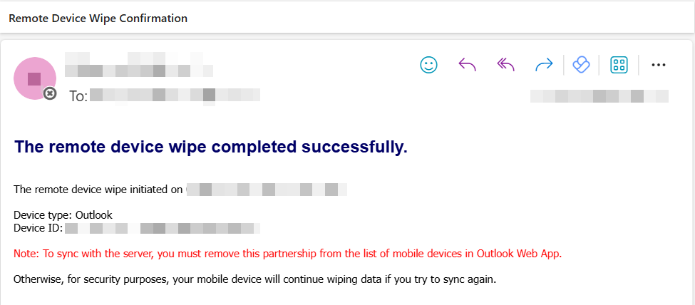

Most people find Exchange Online management a bit tedious when dealing with multiple users. Plenty of time is spent in either on-boarding, off-boarding or incident response procedures.

This article will demonstrate how you can alleviate these pain points with Automation accounts. For those coming from AWS, the equivalent would be Systems Manager. For those starting fresh, think of Automation accounts as cloud-hosted scripts that handle automating a specific task.

I'm going to walk you through how you can use Azure Automation accounts to tap into Exchange Online. You'll learn how to:

1.  Create an Azure Automation account and managed identity
    
2.  Assign permissions to managed identities
    
3.  Create a Runbook that authenticates to and manages Exchange Online
    

You can skip to the [Getting Started](#getting-started) section if you want to jump into technical weeds and already know the basic requirements. Otherwise continue on for a softer introduction.

**What this article is _NOT_**

This article is not meant to be a "best-practices" guide on managing Exchange Online, Managed Identities, or Azure resources. It is meant to demonstrate how you can connect the dots.

With that out of the way, let's have some fun.

**The Scenario:** For this demo, we will wipe an Exchange mailbox on a mobile device. In essence, we are removing company data from a mobile device and preventing it from connecting to Exchange.

### Prerequisites

You will need the _Automation Contributor_ role (an [Azure built-in role](https://learn.microsoft.com/en-us/azure/role-based-access-control/built-in-roles)) to create [Automation accounts](https://learn.microsoft.com/en-us/azure/automation/overview). Make sure you have this role under the correct Azure resource where your Automation account will live. You will also need the _Privileged Role Administrator_ role (an [Entra built-in role](https://learn.microsoft.com/en-us/entra/identity/role-based-access-control/permissions-reference)) to add permissions to your [managed identity](https://learn.microsoft.com/en-us/entra/identity/managed-identities-azure-resources/overview). Both roles can be permanently assigned or elevated to by using [Privileged Identity Management (PIM)](https://hassananees.com/posts/simplifying-access-control-with-privileged-identity-management-pim-in-entra-id/). You will also require:

*   An Azure Subscription
    
*   A resource group under that Subscription (this is where the Automation account will live)
    
*   Office 365 Exchange Online resource within Entra ID. Below is a snippet of PowerShell that checks if the resource exists. If nothing shows up, then you will have to set this up. Utilize this [resource](https://learn.microsoft.com/en-us/powershell/exchange/connect-exo-powershell-managed-identity?view=exchange-ps#what-to-do-if-the-office-365-exchange-online-resource-is-not-available-in-microsoft-entra-id) to do so
    

```powershell
# check-exchange-online-resource.ps1
Connect-MgGraph
Get-MgServicePrincipal -Filter "AppId eq '00000002-0000-0ff1-ce00-000000000000'"
```

### The Baseline Manual Process

For some reference, below is the manual workflow that will be automated.

1.  Go to Exchange Online: [admin.exchange.microsoft.com](http://admin.exchange.microsoft.com)
    
2.  Select **Mailboxes**
    
3.  Search and select a specific user
    
4.  Select **Manage mobile devices**
    
5.  Click **Account Only Remote Wipe Device**
    


Doing the above is fine for single instances, but this becomes unfeasible in an enterprise environment where there big batches of new and departing users on a recurring basis or circumstances call for time-sensitive actions.

### Getting Started

Let's create the Automation account called "Automation-Account-Workshop". We will also be creating a managed identity in this step.

1.  Elevate to the Automation Contributor role with [PIM](https://hassananees.com/posts/simplifying-access-control-with-privileged-identity-management-pim-in-entra-id/) _(if applicable, otherwise skip)_
    
2.  Head on over to [portal.azure.com](http://portal.azure.com)
    
3.  Search for **Automation account**
    
4.  Click on **Create**
    
5.  Enter Automation account details (Name, Subscription, Resource group, Region)
    
6.  Under the _Advanced_ tab, ensure that **System-assigned** identity is enabled
    
7.  For the _Networking_ tab, select **public access** (utilizing **private access** requires you to set up a **private endpoint** and **vnets** which = $$$ and complexity. This is a POC)
    
8.  Review and click **Create**
    



Now that we have created the Automation account we can finish setting up the managed identity piece by granting it the necessary permissions.

### Granting Permissions to the Managed Identity

We need to assign both permissions and an Entra role to the managed identity. Remember, a **permission** is granular, usually a single action whereas a **role** is a collection of permissions. At a high-level, the managed identity will be able to do the following:

1.  Reach out to Exchange Online (managed identity is assigned a **permission**)
    
2.  Perform tasks within Exchange Online (managed identity is assigned a **role**)
    

We'll start with the first part of assigning the managed identity the permission needed to reach out to Exchange Online.

1.  Elevate to the Privileged Role Administrator role with [PIM](https://hassananees.com/posts/simplifying-access-control-with-privileged-identity-management-pim-in-entra-id/) _(if applicable, otherwise skip)_
    
2.  Navigate to Automation account [portal.azure.com](http://portal.azure.com) > **Automation accounts >** Search and click **Automation-Account-Workshop**
    
3.  Navigate to **Account Settings** > **Identity** > Copy the **Object** **(principal) Id**. We will use this later in our script to assign permissions
    



4.  Open PowerShell as administrator and execute the script below to assign the **Exchange.ManageAsApp** API permission to the managed identity which allows it call Exchange Online
    
    > Note that we are replacing MI\_ID variable with the value obtained from the last step. For more information on this step, use this [reference](https://learn.microsoft.com/en-us/powershell/exchange/connect-exo-powershell-managed-identity?view=exchange-ps#step-4-grant-the-exchangemanageasapp-api-permission-for-the-managed-identity-to-call-exchange-online)
    

```powershell
# assigning-permissions-to-managed-identity.ps1
# Connecting to assign permissions via Microsoft Graph
Connect-MgGraph -Scopes AppRoleAssignment.ReadWrite.All,Application.Read.All

$MI_ID = "<object-id-obtained-in-previous-step>"

# The id (GUID) for the Exchange.ManageAsApp API permission. This is the same for all organizations
$AppRoleID = "dc50a0fb-09a3-484d-be87-e023b12c6440"

# This value is different for all organizations
$ResourceID = (Get-MgServicePrincipal -Filter "AppId eq '00000002-0000-0ff1-ce00-000000000000'").Id

# Here you are assigning the permissions
New-MgServicePrincipalAppRoleAssignment -ServicePrincipalId $MI_ID -PrincipalId $MI_ID -AppRoleId $AppRoleID -ResourceId $ResourceID
```

After the successful execution of the script, our managed identity has the authorization to reach out to Exchange Online. If the prior step did not work, double check the prerequisites and utilize this [reference](https://learn.microsoft.com/en-us/powershell/exchange/connect-exo-powershell-managed-identity?view=exchange-ps#step-4-grant-the-exchangemanageasapp-api-permission-for-the-managed-identity-to-call-exchange-online).

We'll move on to the second part of assigning the role needed to execute actions within Exchange Online. Exchange also has its own RBAC system in place that allows more granular access control. However, for the sake of simplicity we will assign a broad role like Exchange Administrator which is available in Entra.

1.  Navigate to [entra.microsoft.com](http://entra.microsoft.com) > **Roles**
    
2.  Select **Roles & admins**
    
3.  Search and select **Exchange Administrator**
    
4.  Click on **Add assignments**
    
5.  Select **members**
    
6.  Copy and paste the object id of the managed identity (it will be seen as an enterprise application)
    
7.  Hit **Select**
    



This wraps up the roles and permissions part for the managed identity. We'll move to the final phase of creating the runbook within the Automation account.

### Runbook Creation and Configuration

We've done the leg work to ensure that the managed identity has the right access. This section will focus on creating a runbook that will tap into Exchange Online and execute some actions.

Let's jump back to the Automation account to finish configuring the environment and creating the runbook. First we'll need to install three modules to ensure that our runbook has the required dependencies to run.

1.  Navigate to [portal.azure.com](http://portal.azure.com) > **Automation account**
    
2.  Search and select "Automation-Account-Workshop"
    
3.  Click on **Shared Resources** > **Modules**
    
4.  Click on **Add a module**
    
5.  Select **Browse from gallery** >Select **Click here to browse from gallery** > Search for **PackageManagement**
    
6.  Choose **Runtime version** as **5.1**
    
7.  Repeat for steps 4 - 6 for the **PowerShellGet** and **ExchangeOnlineManagement** modules
    



With the dependencies out of the way we can create the runbook. To expand further, you can think of a runbook as a fancy name for a cloud hosted script.

1.  Navigate to [portal.azure.com](http://portal.azure.com) > **Automation account**
    
2.  Search and select "Automation-Account-Workshop"
    
3.  Click on **Process Automation** > **Runbooks** > Click on **Create a runbook**
    
4.  Under the _Basics_ tab, select **PowerShell** for the **Runbook type** and **5.1** for the **Runtime version**
    
5.  Enter the details for the remaining items and click **Create**
    



We have created the runbook, but now we require the script to execute our actions on Exchange Online. I'll provide a basic script that will do the following.

1.  Take in a user principal name (the target user)
    
2.  Connect to Exchange Online via managed identity
    
3.  Lists the mobile devices on which the mailbox is synced
    
4.  Wipes the container (Exchange mailbox) for each device
    

> **Note that you should test and validate within your own environment first**. Utilize this [resource](https://learn.microsoft.com/en-us/exchange/clients/exchange-activesync/remote-wipe) to understand the impact of utilizing the "Clear-MobileDevice" command as using it incorrectly can potentially **wipe the entire device**. The goal is to wipe the container (Exchange mailbox) only

```powershell
# remove-company-data.ps1

param (
    [Parameter(Mandatory=$true)]
    [string]$UserPrincipalName
)

# Connecting via managed identity. That managed identity is using ExchangeAsApp.api - leveraged from the enterprise application for Exchange Online within Entra
Connect-ExchangeOnline -ManagedIdentity -Organization <your-organization>.onmicrosoft.com

Get-MobileDevice -Mailbox $UserPrincipalName | ForEach-Object {
    Write-Output "-------------------------------"
    Write-Output "The following device will be deleted"
    $_ | Format-List  # This shows the entire object in a readable format
    Write-Output "-------------------------------"

# Using the -AccountOnly flag is needed to remove the container only
   Clear-MobileDevice -AccountOnly -Identity $_.Identity -NotificationEmailAddresses "youremail@yourorganization.com" -Confirm:$false
}
```

The sample script is intended to be a basic starting point. You can add input validation, format the data, and add try-catch statements. Test within your own environment as the wipe command will behave differently depending whether the mailbox on a native mail client or an outlook client. From my brief testing I found the following.

| Device OS | Outlook Mail Client | Native Mail Client |
| --- | --- | --- |
| iOS | **✅ (container only wipe)** | ✅ **(container only wipe)** |
| Android | ✅ **(container only wipe)** | ❌ **(fails container only wipe)** |

Let's now add the script to the Automation account.

1.  Select **Edit** > **Edit in portal**
    
2.  Add your PowerShell script here
    
3.  Select **Save** > Click on **Test pane**
    
4.  Within **Test pane** enter the user principal name of the target (ex. [testaccount@redacted.com](mailto:testaccount@redacted.com))
    
5.  Click **Start**. Note that the execution will take couple of minutes. To test the PowerShell script more rapidly, you can run the script locally, but you will have to connect with delegated permissions (see line 8).
    
6.  Verify the results and return to the prior screen to click on **Publish** to confirm the changes
    

> As mentioned earlier, we are primarily concerned with the **ClientType** being **Outlook** as it provides reliable results for wiping the container (mailbox) from the device. The second thing of note is the **Identity** value as this uniquely identifies the mobile device and is used within the **Clear-MobileDevice** command.

You have the option to send a notification for when this the wipe command is executed. Below is an example of the output. Note that you will continuously get this notification each time the end users attempts to sign in into their mailbox.



### Bravo! You Made It To the End 👏

This demo should serve as a starting point as there's plenty more which can be improved (error handling, data parsing, additional functionality).

We can even take this a step further and have Automation accounts be triggered by playbooks within Sentinel, but maybe that's a write up for another day. If you have any questions, I’d love to hear from you! Hope this helped.