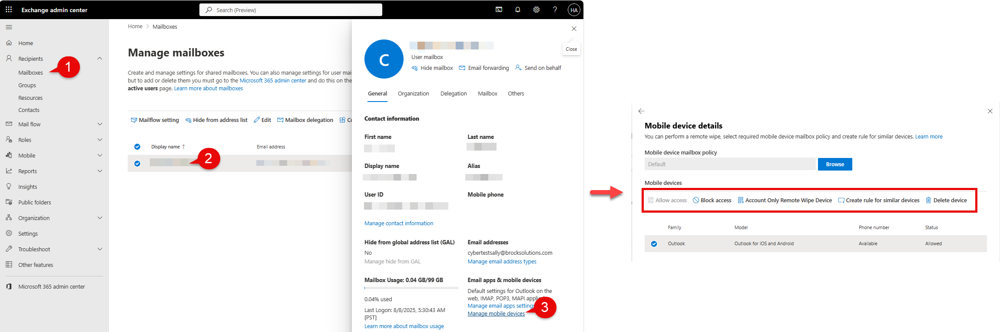
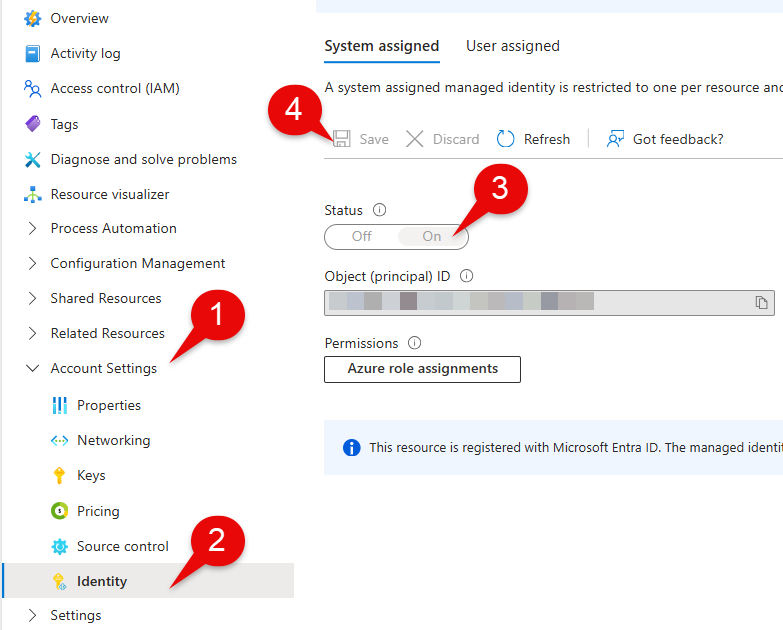

Most people find Exchange Online management a bit tedious when dealing multiple users. Plenty of time is spent in either on-boarding, off-boarding or incident response procedures.

This article will demonstrate how you can alleviate these pain points with Automation accounts. For those coming from AWS, the equivalent would be Systems Manager. For those starting fresh, think of Automation accounts as cloud-hosted scripts that handle automating a specific task.

I'm going to walk you through how you can use Azure Automation accounts to tap into Exchange Online. You'll learn how to:

1.  Create an Azure Automation account
    
2.  Create a managed identity
    
3.  Assign permissions and roles to managed identities
    
4.  Create a Runbook
    
5.  Authenticate to Exchange Online with managed Identities
    
6.  Manage Exchange Online with PowerShell
    

**What this article is _NOT_**

This article is not meant to be a "best-practices" guide on managing Exchange Online, Managed Identities, or Azure resources. It is meant to demonstrate how you can connect the dots.

With that out of the way, let's have some fun.

**The Scenario:** For this demo, we will wipe company data from a mobile device listed in Exchange Online in a safe and reliable way.

### Prerequisites

You will need the _Automation Contributor_ role (an [Azure built-in role](https://learn.microsoft.com/en-us/azure/role-based-access-control/built-in-roles)) to create [Automation accounts](https://learn.microsoft.com/en-us/azure/automation/overview). Make you have this role under the correct Azure resource where your Automation account will live. You will also need the _Privileged Role Administrator_ role (an [Entra built-in role](https://learn.microsoft.com/en-us/entra/identity/role-based-access-control/permissions-reference)) to add permissions to your [managed identity](https://learn.microsoft.com/en-us/entra/identity/managed-identities-azure-resources/overview). Both roles can be permanently assigned or elevated to using [Privileged Identity Management (PIM)](https://hassananees.com/posts/simplifying-access-control-with-privileged-identity-management-pim-in-entra-id/). You will also require:

*   An Azure Subscription
    
*   A resource group under that Subscription (this is where the Automation account will live)
    
*   Office 365 Exchange Online resource within Entra ID. Below is a snippet of PowerShell to check if you do. If not, utilize this [resource](https://learn.microsoft.com/en-us/powershell/exchange/connect-exo-powershell-managed-identity?view=exchange-ps#what-to-do-if-the-office-365-exchange-online-resource-is-not-available-in-microsoft-entra-id)
    

```powershell
# check-exchange-online-resource.ps1
Connect-MgGraph
Get-MgServicePrincipal -Filter "AppId eq '00000002-0000-0ff1-ce00-000000000000'"
```

**Some Context: The not so fun manual process...**

For some reference, below is the manual workflow.

1.  Go to Exchange Online: [admin.exchange.microsoft.com](http://admin.exchange.microsoft.com)
    
2.  Select "Mailboxes"
    
3.  Search and select specific user
    
4.  Select "Manage mobile devices"
    
5.  Click "Account Only Remote Wipe Device"
    



Doing the above is fine for single instances, but this becomes unfeasible in an enterprise environment where there big batches of new and departing users on a recurring basis or circumstances calls for time-sensitive actions.

### Getting Started

Let's create the Automation account called "Automation-Account-Workshop". We will also be creating a managed identity in this step.

1.  Elevate with [PIM](https://hassananees.com/posts/simplifying-access-control-with-privileged-identity-management-pim-in-entra-id/) to the Azure built-in role Automation Contributor _(if applicable, otherwise skip)_
    
2.  Head on over to [portal.azure.com](http://portal.azure.com)
    
3.  Search for **Automation account**
    
4.  Click on **Create**
    
5.  Enter Automation account details (Name, Subscription, Resource group, Region)
    
6.  Under the _Advanced_ tab, ensure that **System-assigned** identity is enabled
    
7.  For the _Networking_ tab, select **public access** (utilizing **private access** requires you to set up a **private endpoint** and **vnets** which = $$$ and complexity. This is a POC)
    
8.  Review and click **Create**
    


Now that we have created the Automation account we can finish setting up the managed identity piece by granting it the necessary permissions and Entra roles.

### Granting Permissions to the Managed Identity

We are doing two things here.

1.  Giving the ability to reach out to Exchange Online
    
2.  Perform tasks within Exchange Online (limited to what the assigned role can do).
    

What we are doing in this section is granting the necessary permissions and roles for our Automation account to reach out to Exchange Online and perform any tasks we There are two parts to this section.

First is granting the Exchange.ManageAsApp API permission for the managed identity. This will let the managed identity reach out to Exchange Online. Second is granting the managed Identity an Entra role which will allow it to

Now that we have created the Automation account we can finish setting up the managed identity piece by granting it the necessary Entra roles. For the purpose of this demo, we will go broader than necessary by assigning the managed identity.

1.  Open the
    
2.  Elevate with [PIM](https://hassananees.com/posts/simplifying-access-control-with-privileged-identity-management-pim-in-entra-id/) to the Entra built-in role Privileged Role Administrator _(if applicable, otherwise skip)_
    



For this demo, we are going to be a bit more by downloaded the necessary dependencies needed to access Exchange Online.

Now that we have created the Automation account, we can create the associated runbook (a fancy name for a cloud-hosted script) that will.