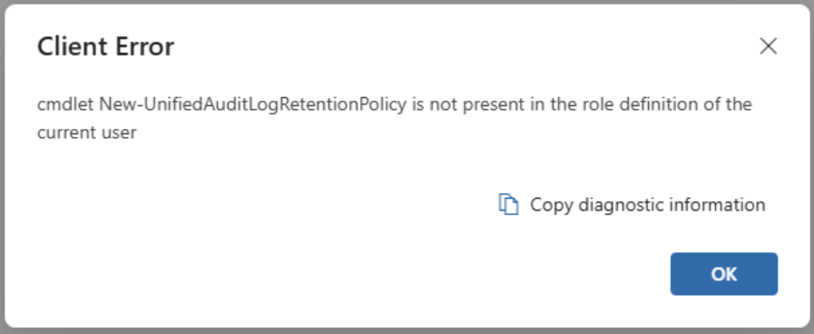

Your Azure environment might be missing key audit events within Unified Audit Log (UAL) that are needed for forensic investigations. Audit events like MailItemsAccessed is a must when investigating a compromised user. In the event of a breach, your team needs all the insight they can get to validate any impact on business critical data. I'll show you a simple Purview configuration so your compliance and security teams won't waste a second scrambling for missing puzzle pieces.

You can jump to the [Getting Started](#getting-started) section for the solution. Otherwise, continue on for background on UAL, audit events, retention policies, and why key information may be missing.

### Unified Audit What? Mail Items Who?

Unified Audit Log (UAL) is a collection of records of both user and administrative actions done across the Microsoft 365 suite. UAL contains audit events from the following M365 services:

*   Exchange
    
*   SharePoint
    
*   OneDrive
    
*   Teams
    

You can start seeing how useful UAL would be within forensic investigations when your team needs to correlate activities within the M365 suite. Attacks like Business Email Compromise (BEC) are common across industries making information coming from UAL invaluable when investigating compromised accounts.

You can access UAL in following methods:

| Source | Tool / Table |
| --- | --- |
| Purview | Audit (_Tool)_ |
| PowerShell | Microsoft Extractor Suite ([_Tool_](https://github.com/invictus-ir/Microsoft-Extractor-Suite)_)_ |
| Microsoft Sentinel | OfficeActivity (_Table)_ |
| Defender XDR for Cloud Apps | CloudAppEvents _(Table)_ |

One useful audit event to help email compromise investigations is the MailItemsAccessed event which shows sync and bind activity for a users mailbox. Sync operations are generated whenever a mail client application downloads mail items. Bind operations record individual access to an email message. If you want more detail, Microsoft has some good [documentation](https://learn.microsoft.com/en-us/purview/audit-log-investigate-accounts) on this.

Unfortunately, your environment may be missing such logs since not all event logging in Unified Audit Log (UAL) is enabled by default if users are being licensed via inheritance. I'll show how to can remediate this by enabling an audit retention policy within Microsoft Purview.

### Purview Audit Retention Policy

I'll give a short intro on Purview and audit retention policies. If you're unfamiliar with and its importance. a brief introIf you're unfamiliar In short, an audit - (good primer that was provided when discussing data sensitivity labels)

### Prerequisites

You will need the following to get rolling:

1.  The _Organization Management_ role (a Purview Portal role) to create [**Audit Retention policies**](https://learn.microsoft.com/en-us/purview/audit-log-retention-policies).
    
2.  End users with an E3 or E5 license to see audit events like MailItemsAccessed
    

To assign the role, do the following:

1.  Head over to [purview.microsoft.com](http://purview.microsoft.com)
    
2.  Click on **Settings** on the left
    
3.  Select **Roles and scopes** > **Role groups**
    
4.  Click **Organization Management** > **Edit** > **Choose users** > **Save**
    

> Note that if you have trouble viewing the Role and scopes section within Purview, you likely require an admin with the Global Administrator role to assign you the proper permissions

### Getting Started

With all the fluff out of the way, let's start creating our Audit Retention Policy. In short, an audit retention policies

An audit log retention policy lets you specify how long to retain audit logs in your organization

Prereq:

*   A Global Administrator role is required to assign the Organization Management role to an admin to deploy the policy (this role is required to deploy an audit retention policy) otherwise you will get the following error
    

Check within Purview

Creating the audit retention policy

References

*    [Manage audit log retention policies | Microsoft Learn](https://learn.microsoft.com/en-us/purview/audit-log-retention-policies) 
    
*   [https://nathanmcnulty.com/blog/2025/04/comprehensive-guide-to-configuring-advanced-auditing/](https://nathanmcnulty.com/blog/2025/04/comprehensive-guide-to-configuring-advanced-auditing/)