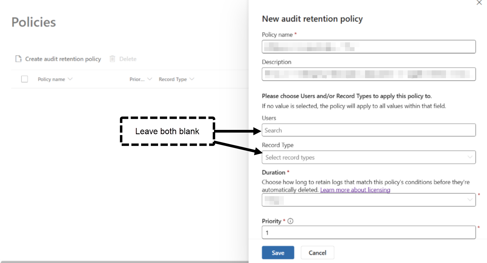

Your Azure environment might be missing key audit events within the Unified Audit Log (UAL) that are needed for forensic investigations. Audit events like MailItemsAccessed is a must when investigating a compromised user. This happens since not all events are enabled or retained by default. I'll show you a simple Purview configuration so your security and compliance teams won't waste a second scrambling for missing puzzle pieces.

You can jump to the [Getting Started](#getting-started) section for the solution. Otherwise, continue on for background on the UAL, audit events, and retention policies.

### Unified Audit What? Mail Items Who?

The **Unified Audit Log** is a collection of records of both user and administrative actions done across the Microsoft 365 (M365) suite. The collection holds audit events from the following M365 services:

*   Exchange
    
*   SharePoint
    
*   OneDrive
    
*   Teams
    

These logs are especially useful in forensic investigations when security teams need to correlate activities within the M365 suite to assess impact on business critical data. Attacks like Business Email Compromise (BEC) are common across industries making information coming from the UAL invaluable when investigating compromised accounts.

You can access the UAL in following methods:

| Source | Tool / Table |
| --- | --- |
| Purview | Audit (_Tool)_ |
| PowerShell | Microsoft Extractor Suite ([_Tool_](https://github.com/invictus-ir/Microsoft-Extractor-Suite)_)_ |
| Microsoft Sentinel | OfficeActivity (_Table)_ |
| Defender XDR for Cloud Apps | CloudAppEvents _(Table)_ |

One useful audit event to help email compromise investigations is the **MailItemsAccessed** event which shows sync and bind activity for a users mailbox. Sync operations are generated whenever a mail client application downloads mail items. Bind operations record individual access to an email message. If you want more detail, Microsoft has some good [documentation](https://learn.microsoft.com/en-us/purview/audit-log-investigate-accounts) on this.

Unfortunately, if users are being licensed (E3/E5) via inheritance then your environment is likely missing these logs. You can quickly check if you have these logs coming in by running the following query within Sentinel.

```kql
OfficeActivity
| where Operation contains "MailItemsAccessed"
```

If they are missing then we can remediate this by enabling an audit retention policy within Microsoft Purview.

### Audit Retention Policy with Purview

An audit retention policy is part of Microsoft Purview Audit. If you've used Purview before, you understand that its capabilities is split between three areas:

1.  Data Security
    
2.  Data Governance and Discovery
    
3.  Compliance and Risk Management
    

The Purview Audit tool lands in the third category for compliance. [Audit retention policies](https://learn.microsoft.com/en-us/purview/audit-log-retention-policies) let you specify how long to retain audit logs for within your organization. These policies are flexible as you can specify retention on all activities in one of more Microsoft Services. You can retain data all the way to 10 years, but of course, you should align with the standard in your industry.

### Prerequisites

You will need the following to get rolling:

1.  The _Organization Management_ role (a Purview Portal role) to create [**Audit Retention policies**](https://learn.microsoft.com/en-us/purview/audit-log-retention-policies).
    
2.  End users with an E3 or E5 license to see audit events like MailItemsAccessed
    

To assign the role, do the following:

1.  Head over to [purview.microsoft.com](http://purview.microsoft.com)
    
2.  Click on **Settings** on the left
    
3.  Select **Roles and scopes** > **Role groups**
    
4.  Click **Organization Management** > **Edit** > **Choose users** > **Save**
    

> Note that if you have trouble viewing the Role and scopes section within Purview, you likely require an admin with the Global Administrator role to assign you the proper permissions

### Getting Started

With all the fluff out of the way, let's start creating our audit retention policy.

1.  Head over to [purview.microsoft.com](http://purview.microsoft.com)
    
2.  Select **Solutions** \> **Explore all**
    
3.  Search for **Audit**
    
4.  Click **Policies**
    

Check within Purview


Creating the audit retention policy



*   **Data Security** 
    
*   Infromation Protection (Project 1 - Phase 1 completed, Phase 2 in progress)  
    
*   **Relevant Documents:** 
    
*   Adding an expiration to a document: [Use Case - Document Expiration.docx](https://brocksolutionsinc.sharepoint.com/:w:/r/sites/COCyberSecurity/_layouts/15/Doc.aspx?sourcedoc=%7B9AE82343-2C91-43D6-8DC5-7AD14F21BF6A%7D&file=Use%20Case%20-%20%20Document%20Expiration.docx&action=default&mobileredirect=true&xsdata=MDV8MDJ8fGRjZTdmM2UwMWE4ZjQ1NjkyNWZkMDhkZGJhNzMyOTA3fGM5MTViYjlmYzhhMTQ0M2JhNjNkMzYzODIzODVmOTQwfDB8MHw2Mzg4NzE3MjU5Mjg5NzQ0NDd8VW5rbm93bnxWR1ZoYlhOVFpXTjFjbWwwZVZObGNuWnBZMlY4ZXlKRFFTSTZJbFJsWVcxelgwRlVVRk5sY25acFkyVmZVMUJQVEU5R0lpd2lWaUk2SWpBdU1DNHdNREF3SWl3aVVDSTZJbGRwYmpNeUlpd2lRVTRpT2lKUGRHaGxjaUlzSWxkVUlqb3hNWDA9fDF8TDJOb1lYUnpMekU1T2pRMlptWmxabVF5WmpCa09UUXdZbVZpTWprNE16TTBOell4WmprMVl6azVRSFJvY21WaFpDNTJNaTl0WlhOellXZGxjeTh4TnpVeE5UYzFOemt5TkRNNXxjOTMzYjQxYjQwZGI0NmMwMjVmZDA4ZGRiYTczMjkwN3w4NGM3YzdiNDFlZDE0N2Q3YWY2MDBmNzY0MDljNTRiMg%3D%3D&sdata=NUJuK0k4dVhYaTlGSW9SUkZuWjgySFpUV251Z2hsNDFma2VPUmplZEd1ST0%3D&ovuser=c915bb9f-c8a1-443b-a63d-36382385f940%2Chanees%40brocksolutions.com)  
    
*   Revoking a document: [Use Case - Document Tracking and Revoking.docx](https://brocksolutionsinc.sharepoint.com/:w:/r/sites/COCyberSecurity/_layouts/15/Doc.aspx?sourcedoc=%7B6d2671d9-a8d7-41a0-a9a9-bb1fef3bfedc%7D&action=edit&wdPid=299e32b3&xsdata=MDV8MDJ8fGRjZTdmM2UwMWE4ZjQ1NjkyNWZkMDhkZGJhNzMyOTA3fGM5MTViYjlmYzhhMTQ0M2JhNjNkMzYzODIzODVmOTQwfDB8MHw2Mzg4NzE3MjU5Mjg5NzQ0NDd8VW5rbm93bnxWR1ZoYlhOVFpXTjFjbWwwZVZObGNuWnBZMlY4ZXlKRFFTSTZJbFJsWVcxelgwRlVVRk5sY25acFkyVmZVMUJQVEU5R0lpd2lWaUk2SWpBdU1DNHdNREF3SWl3aVVDSTZJbGRwYmpNeUlpd2lRVTRpT2lKUGRHaGxjaUlzSWxkVUlqb3hNWDA9fDF8TDJOb1lYUnpMekU1T2pRMlptWmxabVF5WmpCa09UUXdZbVZpTWprNE16TTBOell4WmprMVl6azVRSFJvY21WaFpDNTJNaTl0WlhOellXZGxjeTh4TnpVeE5UYzFOemt5TkRNNXxjOTMzYjQxYjQwZGI0NmMwMjVmZDA4ZGRiYTczMjkwN3w4NGM3YzdiNDFlZDE0N2Q3YWY2MDBmNzY0MDljNTRiMg%3D%3D&sdata=NUJuK0k4dVhYaTlGSW9SUkZuWjgySFpUV251Z2hsNDFma2VPUmplZEd1ST0%3D&ovuser=c915bb9f-c8a1-443b-a63d-36382385f940%2Chanees%40brocksolutions.com) 
    
*   What each label means: [Brock Sensitivity Labels-v2.pdf](https://brocksolutionsinc.sharepoint.com/:b:/r/sites/COCyberSecurity/Shared%20Documents/Projects/2025%20Project%20Management/Security%20-%20Sensitivity%20Labels%20-%20Phase%201%20\(Files%20%26%20Emails\)/Brock%20Sensitivity%20Labels-v2.pdf?csf=1&web=1&e=kdm0du) 
    
*   Previous PowerPoint for additional reference:    
    [Sensitivity Labels (Files & Emails).pptx](https://brocksolutionsinc.sharepoint.com/:p:/r/sites/COCyberSecurity/_layouts/15/Doc.aspx?sourcedoc=%7BE0B418CA-3664-499A-8A4F-6E36DBB08C6B%7D&file=Sensitivity%20Labels%20\(Files%20%26%20Emails\).pptx&action=edit&mobileredirect=true&DefaultItemOpen=1&ct=1740598702770&wdOrigin=OFFICECOM-WEB.MAIN.REC&cid=9aed248c-20df-4f71-844b-c55a6f3e8a21&wdPreviousSessionSrc=HarmonyWeb&wdPreviousSession=d10eb231-3219-4a66-9a35-d3b3abca3cd3&xsdata=MDV8MDJ8fGRjZTdmM2UwMWE4ZjQ1NjkyNWZkMDhkZGJhNzMyOTA3fGM5MTViYjlmYzhhMTQ0M2JhNjNkMzYzODIzODVmOTQwfDB8MHw2Mzg4NzE3MjU5Mjg5NzQ0NDd8VW5rbm93bnxWR1ZoYlhOVFpXTjFjbWwwZVZObGNuWnBZMlY4ZXlKRFFTSTZJbFJsWVcxelgwRlVVRk5sY25acFkyVmZVMUJQVEU5R0lpd2lWaUk2SWpBdU1DNHdNREF3SWl3aVVDSTZJbGRwYmpNeUlpd2lRVTRpT2lKUGRHaGxjaUlzSWxkVUlqb3hNWDA9fDF8TDJOb1lYUnpMekU1T2pRMlptWmxabVF5WmpCa09UUXdZbVZpTWprNE16TTBOell4WmprMVl6azVRSFJvY21WaFpDNTJNaTl0WlhOellXZGxjeTh4TnpVeE5UYzFOemt5TkRNNXxjOTMzYjQxYjQwZGI0NmMwMjVmZDA4ZGRiYTczMjkwN3w4NGM3YzdiNDFlZDE0N2Q3YWY2MDBmNzY0MDljNTRiMg%3D%3D&sdata=ZWhWYzkwOWcxbWZ2eUtaOXZLY29rd3FyQi8reDh6dEZ2WXpMMzEweUlHVT0%3D&ovuser=c915bb9f-c8a1-443b-a63d-36382385f940%2Chanees%40brocksolutions.com) 
    
*   **Upcoming** 
    
*   Naming conventions - Requires executive leadership/business input  
    
*   Extending SharePoint permissions to downloaded documents 
    
*   Final configurations - will be adjusted 
    
*   Data Loss Prevention (Project 2) 
    
*   Insider Risk Management (Project 3) 
    
*   **Data Governance and Discovery** 
    
*   Data Map (Data discovery) - Not licensed/not configured 
    
*   Unified Catalog - Not licensed/not configured 
    
*   **Compliance & Risk Management** 
    
*   Compliance manager 
    
*   eDiscovery and Audit
    

```kql
OfficeActivity
| where Operation contains "MailItemsAccessed"
```

References

*    [Manage audit log retention policies | Microsoft Learn](https://learn.microsoft.com/en-us/purview/audit-log-retention-policies) 
    
*   [https://nathanmcnulty.com/blog/2025/04/comprehensive-guide-to-configuring-advanced-auditing/](https://nathanmcnulty.com/blog/2025/04/comprehensive-guide-to-configuring-advanced-auditing/)