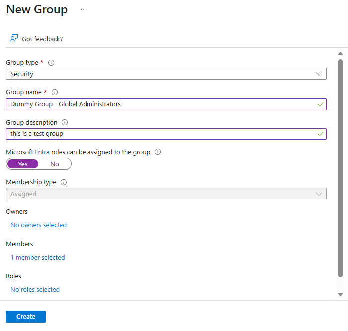
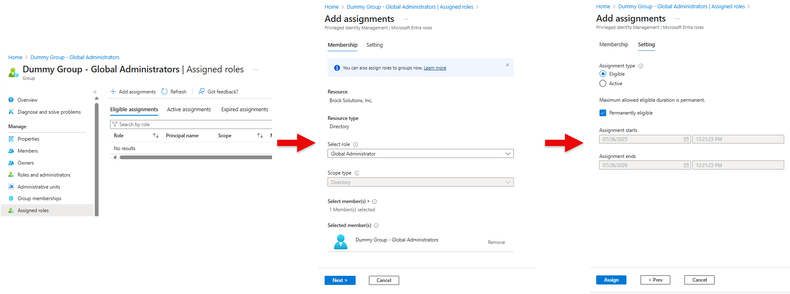
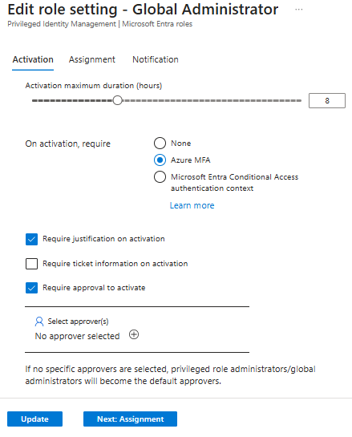

Privileged Identity Management (PIM) is a cool feature. I've been working on implementing it across our organization for the last little while. In short, it's a technology that allows administrators to elevate just-in-time to privileged roles. It leaves an audit trail and limits the duration for the privileged role.

For the purpose of this demo, we'll create a security group called "Dummy Group - Global Administrators" where members of this groups can **elevate** to the Global Administrator role. This ensures that admins are not perpetually in a highly privileged role and leaves an audit trail for when it's utilized.

Here's the overall gist to get things going:

1.  Create an Entra role assignable security group
    
2.  Assign role(s) to the security group
    
3.  Add Members to this group
    
4.  Activate the role in the PIM management blade
    
5.  Rinse and repeat
    

### Prerequisites

You will need the _Privileged Role Administrator_ role assigned to your account in order to create [role assignable security groups](https://learn.microsoft.com/en-us/entra/identity/role-based-access-control/groups-concept)_._ In a nutshell, security groups in Entra ID can have a Entra ID role attached to them now meaning that anyone placed in that group will inherit the assigned role.

As for licensing, any of the following will suffice:

*   Entra ID P2
    
*   Entra ID Governance
    
*   Microsoft E5
    

### Getting Started

Let's create the an Entra role assignable group called "Dummy Group - Global Administrators".

> **_Note_**_: You have a limit of 500 role assignable groups within your tenant._

1.  Start by heading over to [entra.microsoft.com](http://entra.microsoft.com) > **Groups**
    
2.  Select **New Groups**
    
3.  Select **Group Type** as **Security**
    
4.  Enter groups details such as name and description
    
5.  Set **Microsoft Entra roles can be assigned to the group** to **Yes**
    
6.  Select **Members** and add your admin(s)
    
7.  Hit **Create**
    

Now that we have created the group and added members, we can assign it the Global Administrator role.

> **Note**: If you added the role in the previous step then the added users will already have the as **active** by default instead of needing to **elevate**. We require users to be **eligible** for the role.

1.  Select the newly created group
    
2.  Select **Assigned roles**
    
3.  Select **Eligible assignments** and hit **Add assignments**
    
4.  Click the drop down **Select role** to search and select the Global Administrator role and hit **Next**
    
5.  Select **Eligible** and choose the time frame for how long you want the chosen role as eligible. For this demo we will make it permanently eligible
    
6.  Click **Assign**
    

### Activating roles with PIM

We're done with the configuration, let's use it! We can now activate the role going into PIM menu under the Identity Governance section of Entra ID.

1.  Start by heading over to [entra.microsoft.com](http://entra.microsoft.com) > **Identity Governance**
    
2.  Select **Privileged Identity Management** and click **Microsoft Entra roles**
    
3.  Under **Tasks** select **My roles** where you will see any additional roles you are eligible for
    
4.  Select **Activate**
    
5.  Set your required duration and justification and hit **Activate**
    

The current configuration will auto elevate you into the role. There is an option to require approval for added visibility and control. You can do this by:

1.  Heading over to **Privileged Identity Management** menu > **Manage (Microsoft Entra roles)** > **Manage (Roles)**
    
2.  Select the role **Global Administrator**
    
3.  Click **Role settings** > **Edit**
    
4.  Hit **Require approval to activate** to add users who approve/deny requests
    

Under these role settings you have the option to adjust how long a role can be activated for, requiring MFA, and adding it to a Conditional Access authentication context.

There's tons more you can do with PIM that was not covered here. Maybe in another post I'll touch on PIM for groups and Azure resources. If you have any questions, I'd love to hear from you. Hope this helped.